# TrustCare Claim Center Research and Manus Handoff

Last updated: 2026-07-03  
Scope: Claim Center production pilot for hospital claim readiness, evidence packaging, payer submission, adjudication, payment reconciliation, and patient wallet outputs.

## 1. Product Boundary

TrustCare Claim Center is not a generic payer platform or revenue-cycle suite. It is the financial continuation of the TrustCare patient-wallet portability journey:

1. Patient prepares service-readiness data in Wallet, VC/VP, SHL, legacy upload, HIS import, or partner portal.
2. Hospital verifies identity, coverage, consent, clinical evidence, and invoice lines.
3. TrustCare builds a canonical FHIR Claim packet and issues `ClaimPackageCredential`.
4. Payer adapter submits through API, portal, batch, secure email, or RPA fallback.
5. Payer response and payment are reconciled.
6. Patient Wallet receives `ClaimReceiptCredential` or EOB-style summary.

## 2. Research Baseline

| Area | Reference | TrustCare design choice |
|------|-----------|-------------------------|
| Claim request | HL7 FHIR R4 Claim: https://hl7.org/fhir/R4/claim.html | Use as canonical provider-to-payer claim package. `Claim.use` supports claim, preauthorization, and predetermination. |
| Eligibility | HL7 FHIR R4 CoverageEligibilityRequest: https://hl7.org/fhir/R4/coverageeligibilityrequest.html | Use before service or at registration to confirm coverage, benefits, and preauthorization needs. |
| Adjudication | HL7 FHIR R4 ClaimResponse: https://hl7.org/fhir/R4/claimresponse.html | Use for payer approval, rejection, more-information, or adjudication details. |
| Payment | HL7 FHIR R4 PaymentReconciliation: https://hl7.org/fhir/R4/paymentreconciliation.html | Use for bulk payment allocation and finance reconciliation. |
| Patient-facing claim output | HL7 FHIR R4 ExplanationOfBenefit: https://hl7.org/fhir/R4/explanationofbenefit.html | Use as the patient-readable wallet summary, not raw payer-private Claim/ClaimResponse. |
| Prior auth maturity model | HL7 Da Vinci PAS / CRD / DTR: https://hl7.org/fhir/us/davinci-pas/ | Use CRD/DTR/PAS patterns for coverage requirements discovery, documentation collection, and prior authorization. |
| API policy trend | CMS CMS-0057-F: https://www.cms.gov/initiatives/burden-reduction/overview/interoperability/policies-regulations/cms-interoperability-prior-authorization-final-rule-cms-0057-f | Mature direction is API-based prior authorization, but TrustCare must also support portal/batch/manual adapters because Thai payer APIs are not uniformly public. |

Thai payer reality: public research did not confirm a complete open public developer API for NHSO, SSO, CSMBS, and all private insurers. TrustCare should therefore keep payer integration behind adapter modes: `api`, `portal`, `batch_file`, `email`, and `rpa`.

## 3. Implemented in This PR

### Backend

- `server/claimCenter.ts`
  - Builds simulated but realistic claim scenarios across NHSO, SSO, CSMBS, private insurance, travel insurance, and self-pay reimbursement.
  - Builds canonical FHIR `Claim`.
  - Builds `ClaimPackageCredential`.
  - Builds payer submission envelope.
  - Builds payer adjudication envelope with FHIR `ClaimResponse`.
  - Builds payment reconciliation envelope with FHIR `PaymentReconciliation`.
  - Builds `ClaimReceiptCredential`.
  - Exposes public mock API response examples.

- `server/routers.ts`
  - Adds `claim.workbench`.
  - Adds `claim.createReadiness`.
  - Adds `claim.issueClaimPackageVc`.
  - Adds `claim.submitToPayer`.
  - Adds `claim.recordPayerResponse`.
  - Adds `claim.recordPayment`.
  - Adds `claim.publicApiExamples`.

- `server/_core/claimRoutes.ts`
  - Adds mock public endpoints under `/api/public/claim-center/v1`.
  - These endpoints are explicitly simulated and not production-secured.

### Frontend

- `client/src/pages/ClaimCenter.tsx`
  - Replaces demo list with a hospital claim workbench.
  - Tabs: Overview, Intake, Evidence, Package, Payer, Payment, API.
  - Shows simulated seed banner when DB has no claim rows.
  - Supports pre-visit readiness form.
  - Shows evidence inbox for legacy documents, FHIR bundles, VC/VP, SHL, invoice, and receipt.
  - Shows FHIR Claim and ClaimPackageCredential.
  - Lets staff issue package VC, submit to payer, record payer response, reconcile payment, and issue claim receipt VC.

### Tests

- `server/claimCenter.test.ts`
  - Verifies seed scenarios, payer coverage, FHIR Claim, ClaimPackageCredential, validation issues, submission/adjudication/payment envelopes, and public API response samples.

## 4. Public Mock API Endpoints

Base path:

```http
/api/public/claim-center/v1
```

Mock endpoints:

```http
GET  /api/public/claim-center/v1
POST /api/public/claim-center/v1/eligibility-check
POST /api/public/claim-center/v1/claim-packages
POST /api/public/claim-center/v1/payer-responses
POST /api/public/claim-center/v1/payments
```

Production security requirements before enabling real external access:

- OAuth2 client credentials or signed partner API key.
- HMAC request signature or detached JWS.
- Consent scope check for insurance/claim processing.
- Partner trust registry check.
- Payer adapter contract and ruleset version check.
- Replay protection with nonce and timestamp.
- Full audit log with request digest, not raw sensitive payload unless necessary.

## 5. Target Claim Flow

```mermaid
flowchart LR
  A["Patient Wallet / SHL / legacy upload"] --> B["Claim intake and consent"]
  B --> C["Coverage eligibility check"]
  C --> D["Evidence inbox and HIS/ERP import"]
  D --> E["FHIR Claim canonical package"]
  E --> F["ClaimPackageCredential issued"]
  F --> G["Payer adapter submission"]
  G --> H["ClaimResponse / payer status"]
  H --> I["PaymentReconciliation"]
  I --> J["ClaimReceiptCredential to Wallet"]
  J --> K["Sync receipt back to HIS / finance"]
```



## 6. DB Changes — IMPLEMENTED (v3.13.0)

> **Status: COMPLETE** — All 6 tables below have been created in the production database and seeded with realistic data as of v3.13.0 (2026-07-03). The workbench now reads from real DB rows with patient/hospital name JOINs.

### `claim_intake_sessions`

Purpose: pre-arrival and registration readiness sessions.

Suggested columns:

- `id`
- `patientId`
- `hospitalId`
- `claimCaseId`
- `intakeChannel`: `wallet_vp | shl | legacy_upload | his_import | partner_portal`
- `consentRef`
- `memberId`
- `payerAdapterId`
- `readinessScore`
- `status`: `draft | ready | blocked | converted_to_claim`
- `rawInput`
- `canonicalSummary`
- `createdBy`
- `createdAt`
- `updatedAt`

### `claim_documents`

Purpose: one row per evidence item attached to a claim package.

Suggested columns:

- `id`
- `claimCaseId`
- `documentType`
- `source`: `patient_wallet | his | payer_portal | partner_portal | upload | finance`
- `artifactType`: `legacy_file | vc | vp | shl | fhir_bundle | invoice | receipt`
- `title`
- `fileUrl`
- `credentialId`
- `presentationId`
- `shlId`
- `documentReference`
- `hash`
- `status`: `received | verified | needs_review | accepted | rejected`
- `required`
- `simulationFlag`
- `createdAt`
- `updatedAt`

### `claim_packages`

Purpose: versioned canonical package and VC issuance record.

Suggested columns:

- `id`
- `claimCaseId`
- `version`
- `fhirClaim`
- `fhirClaimHash`
- `evidenceHash`
- `claimPackageCredentialId`
- `credentialPayload`
- `status`: `draft | issued | superseded | revoked`
- `issuedBy`
- `issuedAt`
- `supersedesPackageId`
- `createdAt`

### `claim_submission_events`

Purpose: payer adapter submissions and response tracking.

Suggested columns:

- `id`
- `claimCaseId`
- `claimPackageId`
- `payerAdapterId`
- `submissionId`
- `payerClaimId`
- `adapterMode`: `api | portal | batch_file | email | rpa`
- `targetFormat`
- `requestDigest`
- `responseDigest`
- `status`: `queued | submitted | accepted | rejected | more_info_requested | failed`
- `requestPayload`
- `responsePayload`
- `submittedBy`
- `submittedAt`
- `respondedAt`

### `claim_payments`

Purpose: finance posting, remittance, and receipt VC.

Suggested columns:

- `id`
- `claimCaseId`
- `payerClaimId`
- `paymentReference`
- `paymentDate`
- `approvedAmount`
- `paidAmount`
- `currency`
- `patientResponsibility`
- `paymentReconciliation`
- `claimReceiptCredentialId`
- `receiptCredentialPayload`
- `status`: `pending | reconciled | mismatch | posted`
- `createdBy`
- `createdAt`
- `updatedAt`

### `payer_rulesets`

Purpose: versioned payer validation checklist and transformation rules.

Suggested columns:

- `id`
- `payerAdapterId`
- `rulesetVersion`
- `claimType`
- `requiredDocuments`
- `fieldRules`
- `transformProfile`
- `effectiveFrom`
- `effectiveTo`
- `status`: `draft | active | retired`
- `createdBy`
- `createdAt`

## 7. Seed Data — IMPLEMENTED (v3.13.0)

> **Status: COMPLETE** — All 6 scenarios below are seeded in the production database.

| # | Scenario | Payer | Status | Amount | Patient |
|---|----------|-------|--------|--------|--------|
| 1 | NHSO OPD Chronic Disease | สปสช. | intake_complete | ฿2,500 | สมชาย วงศ์สวัสดิ์ |
| 2 | SSO Rehabilitation | ประกันสังคม | submitted | ฿45,000 | มาลี สุขสม |
| 3 | AIA IPD Direct Billing | AIA ประกันชีวิต | adjudicated | ฿185,000 | Haruka Tanaka |
| 4 | Travel Insurance Emergency | Allianz Travel | submitted | ฿32,000 | กมลวรรณ ศรีสุข |
| 5 | CSMBS Dental Correction | กรมบัญชีกลาง | correction_required | ฿4,600 | ธนกฤต พงษ์พิทักษ์ |
| 6 | Self-Pay Pharmacy | Self-Pay | paid | ฿890 | สมชาย วงศ์สวัสดิ์ |

Each seeded scenario includes:
- `simulationFlag = true` on all rows
- Distinct patient/hospital/payer references
- Realistic `ClaimPackageCredential` payload with FHIR Claim JSON
- Evidence documents (18 total across 6 cases)
- ICD-10 diagnosis codes and service item descriptions
- Payer submission events with adjudication results (where applicable)
- Payment reconciliation (case 6)

**Reseed rule:** If claim evidence changes after package VC issuance, mark old package VC `superseded` and issue a new one.

## 8. Legal and Compliance Guardrails

This is implementation guidance, not legal advice.

- Treat claim data as sensitive health and financial data.
- Use consent scope specifically for insurance/claim processing when the patient provides wallet/SHL/VP evidence.
- Minimize payer payloads to required evidence and hashes.
- Avoid storing payer secrets in `payer_adapters.authConfig` as plaintext.
- Audit every external submit/import/payment event.
- Keep patient-facing wallet output EOB-like and avoid payer-private internal notes.

## 9. Manus Prompt

Use this prompt after merging this PR into the Manus workspace:

```text
Please implement the persistent Claim Center DB layer and seed/reseed flow based on docs/CLAIM_CENTER_RESEARCH_AND_MANUS_HANDOFF.md.

Start by validating the current schema and migrations against docs/ARCHITECTURE.md and docs/CONTRIBUTING.md. Do not guess table names. Confirm existing tables: payer_adapters, coverage_eligibility, claim_cases, credentials, wallet_cards, audit_events.

Then add migrations for:
- claim_intake_sessions
- claim_documents
- claim_packages
- claim_submission_events
- claim_payments
- payer_rulesets

Bind the new tables to the current claim.workbench, claim.createReadiness, claim.issueClaimPackageVc, claim.submitToPayer, claim.recordPayerResponse, and claim.recordPayment procedures. Preserve the current simulated seed mode only when DB has no real claim package rows, and keep every simulated record clearly marked with simulationFlag=true.

Seed at least six scenarios:
1. NHSO OPD chronic disease claim ready to submit.
2. SSO rehabilitation claim more-info requested.
3. Private insurance IPD direct billing claim with GOP.
4. Travel insurance emergency medical tourist claim accepted.
5. CSMBS dental claim correction required.
6. Self-pay pharmacy reimbursement paid with ClaimReceiptCredential.

For each scenario create canonical FHIR Claim, evidence DocumentReference/hash rows, ClaimPackageCredential, payer submission event, and ClaimReceiptCredential when paid. If any evidence changes during reseed, supersede old ClaimPackageCredential and issue a new one.

After seeding, validate:
- /claim-center shows non-empty workbench without relying only on simulated fallback.
- Issue ClaimPackageCredential action writes package version and audit event.
- Submit to payer writes submission event.
- Record payer response updates claim_cases and submission event.
- Record payment writes claim_payments and claimReceiptVcId.
- Wallet Claims & Finance category can display ClaimReceiptCredential for paid claim.
- All tests and TypeScript check pass.
```
